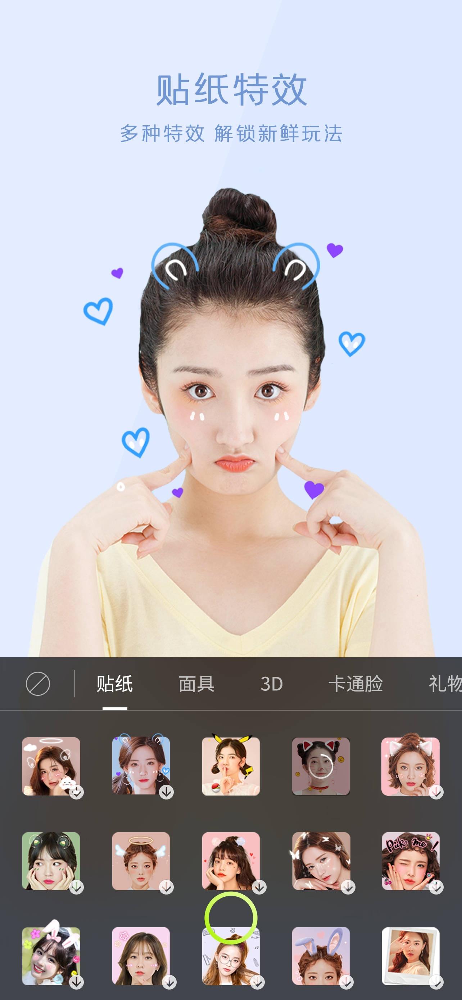
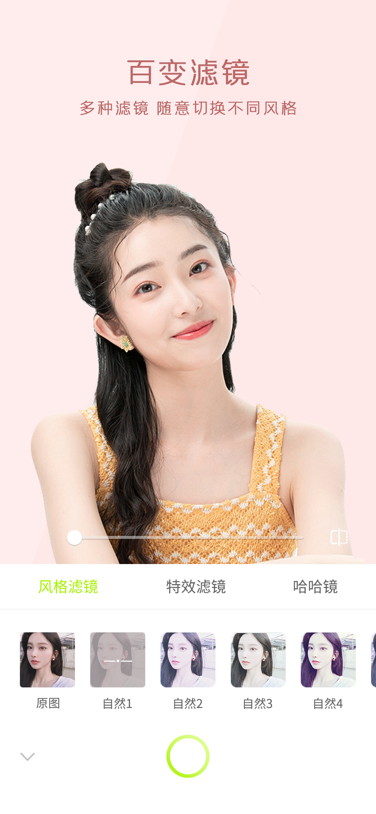
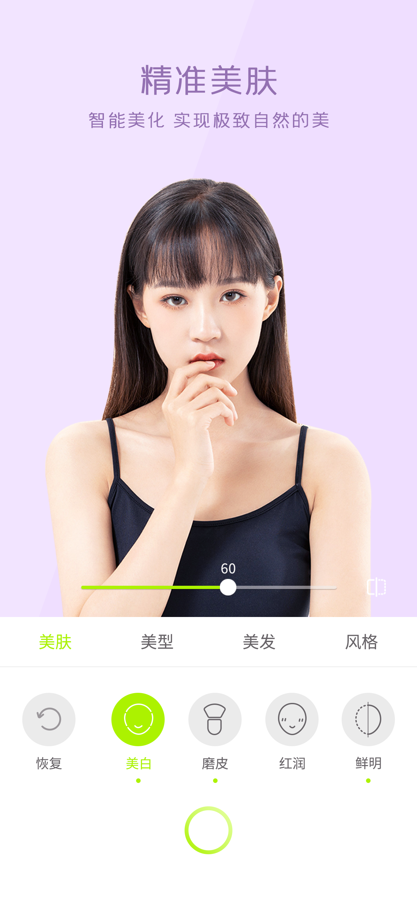

简体中文 | [English](README_EN.md)

# **虹图人像人体 SDK**

<br/>

## **简介**
- 提供面部精致的美颜美型美妆和发色变换效果
- 提供不少于60款风格滤镜、画面炫彩变幻效果的特效滤镜、人脸变形的趣味哈哈镜
- 精致的2D动态贴纸、3D道具、面具、及丰富的全屏3D礼物特效功能
- 可拖拽水印贴纸：支持用户上传，拖拽、缩放、旋转等
- 多种手势识别，并触发特效
- 支持AI背景分割和多种幕布颜色的绿幕抠图功能

<br/>

### **特色**
- 【特效更丰富】：多种AR特效全覆盖，特效类型丰富多样，满足用户多样需求
- 【对接更便捷】：开箱即用型UI可直接对C端使用，对接快且体验好，三行代码快速实现对接
- 【资源支持自设计】：所有素材都支持平台自设计和自定义，打造和平台定位一致的AR素材特效
- 【性能更极致】：行业领先的 AI 算法能力，946人脸关键点让五官定位更精准，人脸表情情绪捕捉更高效、更稳定、更准确
- 【平台化服务更自主】：用户自行注册、登录虹图AI开放平台即可获得人像人体SDK能力，实时对应用状态和信息具备更自由、精准的把控

<br/>

### **效果展示**
- 通过人脸美颜美型、贴纸道具、手势特效到人像背景分割等AR特效，为用户提供围绕人像人体丰富多样的AI+AR技术
<center>
	
    
    
    
</center>
<br/>
<br/>

----

## **快速集成**
### **iOS**
#### **1. 前提条件**
- Xcode 13.0+
- iOS 11.0 以上的 iPhone 真机
- APP ID，由[虹图AI开放平台](https://console.texeljoy.com/login)控制台获取

#### **2. 安装**
您可以选择使用 CocoaPods 自动加载的方式，或者先下载 SDK，再将其导入到您当前的工程项目中

**CocoaPods**
- 编辑Podfile文件：
```shell
pod 'HTEffect'
```

- 安装
```shell
pod install
```

**手动集成**
- 将下载好的 **HTEffect.framework** 库文件和 **HTEffect.bundle** 资源包放到您的项目文件夹下
- 在 Xcode > General 中添加动态库，确保 **Embed** 属性设置为 **Embed&Sign**
- 在 Xcode > Build Settings 中搜索 bitcode ，将 **Enable Bitcode** 设置为 **No**
- 在 Xcode > Info 中添加 **App Transport Security Settings** > **Allow Arbitrary Loads** 并设置为 **YES**

#### **3. 引用**
- 在项目需要使用 SDK API 的文件里，添加模块引用
```objective-c
#import <HTEffect/HTEffectInterface.h>
```

- (可选) HTUI 可根据项目需求选用，将 HTUI 文件夹添加到您的项目文件夹中，在项目需要使用的文件里，添加引用
```objective-c
#import "HTUIManager.h"
```

#### **4. 使用**
**初始化**
- 在您的 App 调用 HTEffect 的相关功能之前（建议在 [AppDelegate application:didFinishLaunchingWithOptions:] 中）进行如下设置
```objective-c
/**
* 在线鉴权初始化方法
*/
[[HTEffect shareInstance] initHTEffect:@"YOUR_APP_ID" withDelegate:self];

/**
* 离线鉴权初始化方法
*/
// [[HTEffect shareInstance] initHTEffect:@"YOUR_APP_ID"];
```

- (可选) 如果需要使用 HTUI，您可以在 viewDidLoad 中添加以下方法
```objective-c
[[HTUIManager shareManager] loadToWindowDelegate:self];
[self.view addSubview:[HTUIManager shareManager].defaultButton];
 ```

**渲染**
- 定义一个 BOOL 变量 **isRenderInit** ，用来标志渲染器的初始化状态，根据获取到的视频格式，采用对应的方法进行渲染
```objective-c
/**
* 视频帧
*/
CVPixelBufferLockBaseAddress(pixelBuffer, 0);
unsigned char *buffer = (unsigned char *) CVPixelBufferGetBaseAddressOfPlane(pixelBuffer, 0);

if (!_isRenderInit) {
    [[HTEffect shareInstance] releaseBufferRenderer];
    _isRenderInit = [[HTEffect shareInstance] initBufferRenderer:format width:width height:height rotation:rotation isMirror:isMirror maxFaces:maxFaces];
}
[[HTEffect shareInstance] processBuffer:buffer];

CVPixelBufferUnlockBaseAddress(pixelBuffer, 0);

/**
* 纹理
*/
// if (!_isRenderInit) {
//     [[HTEffect shareInstance] releaseTextureRenderer];
//     _isRenderInit = [[HTEffect shareInstance] initTextureRenderer:width height:height rotation:rotation isMirror:isMirror maxFaces:maxFaces];
// }
// [[HTEffect shareInstance] processTexture:textureId];
```

**销毁**
- 结束渲染时，需根据视频格式，调用对应的释放方法，通常写在 dealloc 方法里
```objective-c
/**
* 销毁纹理渲染资源
*/
[[HTEffect shareInstance] releaseTextureRenderer];

/**
* 销毁buffer渲染资源
*/
// [[HTEffect shareInstance] releaseBufferRenderer];
```
<br/>

### **Android**
#### **1. 导入工程**
- 将 **HTEffect.aar** 文件拷贝到 app 模块中的 libs 文件夹下，并在 app 模块的 build.gradle 文件的 dependencies 中，增加如下依赖
```shell
dependencies {
 implementation files('libs/HTEffect.aar')
}
```
- 将 jniLibs 文件夹中，各个 ABI 对应的 **libHTEffect.so** 文件，拷贝到对应目录中
- 将 assets 资源文件拷贝到项目的对应目录中

#### **2. 使用 HTUI (可选)**
- 依赖我们的 htui 工程，使用我们提供的开源 UI 库，将 htui 文件夹拷贝到工程根目录下，在工程根目录的 settings.gradle 文件中，增加如下代码
```java
include(":htui")
```
- 在 app 模块中的 build.gradle 文件的 dependencies 中，增加如下代码
```shell
implementation project(':tiui')
```

#### **3. 集成开发**
**初始化**
- HTEffect 初始化函数程序中调用一次即可生效，建议您在 Application 创建的时候调用;如果渲染功能使用不频繁，也可以在使用的时候调用，接口如下
```java
// 在线鉴权初始化方法
HTEffect.shareInstance().initHTEffect(context, "YOUR_APP_ID", new InitCallback() {
        @Override public void onInitSuccess() {}
        @Override public void onInitFailure() {}
});
// 离线鉴权初始化方法
//HTEffect.shareInstance().initHTEffect(context,"YOUR_APP_ID");
```

**添加 HTUI (可选)**
- 设置使用 htui 的 Activity 继承或间接继承 FragmentActivity，例如
```java
public class CameraActivity extends FragmentActivity {
    //...
}
```

- 如果需要使用 htui，请调用 addcontentView 实现UI的添加，代码如下
```java
addContentView(
    new HTPanelLayout(this).init(getSupportFragmentManager()),
    new FrameLayout.LayoutParams(
        ViewGroup.LayoutParams.MATCH_PARENT,
        ViewGroup.LayoutParams.MATCH_PARENT)
);
```

**渲染**
- 定义布尔变量 **isRenderInit** ，用来标志渲染方法是否初始化完成，然后根据得到的视频帧格式的不同，使用对应的方法进行渲染

```java
/**
 * GL_TEXTURE_EXTERNAL_OES 纹理格式
*/
if (!isRenderInit) {
    isRenderInit = HTEffect.shareInstance().initTextureOESRenderer(width, height, rotation, isMirror, maxFaces);
}
int textureId = HTEffect.shareInstance().processTextureOES(textureOES);

/**
 * GL_TEXTURE_2D 纹理格式
*/
if (!isRenderInit) {
    isRenderInit = HTEffect.shareInstance().initTextureRenderer(width, height, rotation, isMirror, maxFaces);
}
int textureId = HTEffect.shareInstance().processTexture(texture2D);

/**
 * byte[] 视频帧
*/
if (!isRenderInit) {
    isRenderInit = HTEffect.shareInstance().initBufferRenderer(format,width, height, rotation, isMirror, maxFaces);
}
HTEffect.shareInstance().processBuffer(buffer);
```

**销毁**
- 结束渲染时，为防止内存泄漏的发生，需根据视频帧格式的不同，调用对应的 destroy 方法释放掉资源，调用位置通常在 视频帧回调接口 的销毁处，或者是 Activity ， Fragment 的生命周期结束处，同时将定义的布尔变量 **isRenderInit** 置为 false
```java
/**
 * 使用其中一个
 */
HTEffect.shareInstance().releaseTextureOESRenderer();
HTEffect.shareInstance().releaseTextureRenderer();
HTEffect.shareInstance().releaseBufferRenderer();

/*
* 将 bool 置为 false
*/
isRenderInit = false;
```

<br/>

----

## **示例代码**
> [Demo下载](https://doc.texeljoy.com/document/hummanBody/beauty/quickStart/demo.html)

<br/>

----

## **最近更新**
- **2023.06.09:** v2.1.0
    - 新增16种高级滤镜
    
- **2023.06.07:** v2.0.2
    - 修复部分机型闪烁的问题
    - 优化资源内存空间处理

- **2023.06.01:** v2.0.1
    - 修复绿幕默认值问题

- **2023.05.17:** 全新2.0版本
    - 新增30多种风格滤镜、特效滤镜、哈哈镜
    - 新增美发、面具、礼物及自定义可拖拽水印
    - 绿幕抠图新增蓝、白两种幕布颜色和参数调节
    - 优化了手势特效和人像分割特效效果
- [更多](https://doc.texeljoy.com/document/hummanBody/beauty/API/api.html)

<br/>

----

## **联系与反馈**
### 1. 官网地址: [www.texeljoy.com](https://www.texeljoy.com)
### 2. 商务合作: 400-178-9918
### 3. 邮箱地址: business@texeljoy.com
### 4. 公众号:
<div align="left">

</div>
